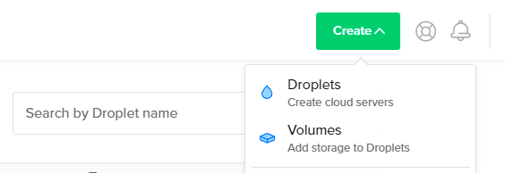
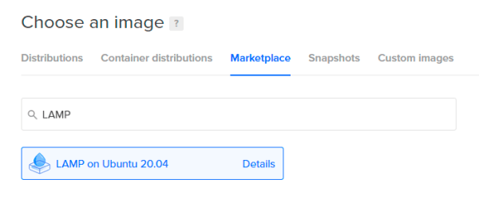
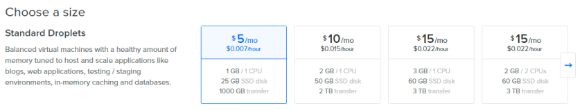
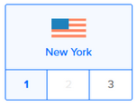
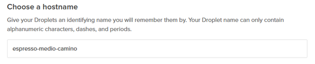
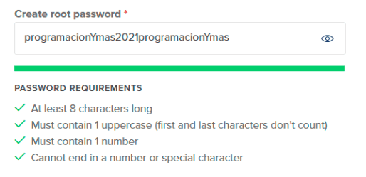
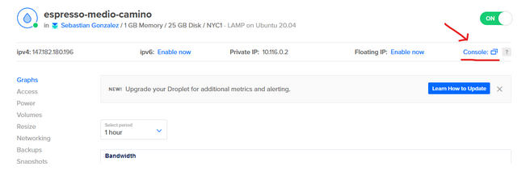
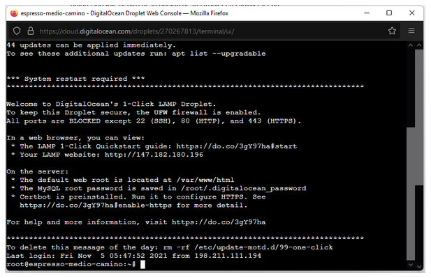
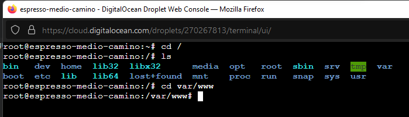
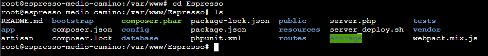

# Desplegar aplicación Laravel a Digital Ocean
En este tutorial manual se describe cómo desplegar la aplicación Laravel hacia un droplet de Digital Ocean.
## ¿Digital Ocean? ¿Droplet?
Digital Ocean ofrece uno de los mejores servicios de VPS (Virtual Private Server) y a un precio justo.

A diferencia de los hosting tradicionales (aquellos que tienen CPanel), en Digital Ocean puedes configurar tú mismo el stack que tu aplicación requiere. 
Además, el equipo de soporte responde de forma atenta y en poco tiempo.

Un droplet es una máquina virtual, a la que tendrás acceso por SSH (vía consola).
En Digital Ocean puedes crear tantos droplets como requieras. Incluso puedes tener varias aplicaciones sobre el mismo droplet (lo que resulta muy útil si deseas tener en línea tus primeros proyectos).

Así mismo, en Digital Ocean el pago es por uso. Eso significa que si a mitad de mes deseas apagar el droplet que creaste, o cancelarlo, podrás hacerlo y pagar por lo que corresponde.
Entonces, empecemos.

## 1.- Tu primer Droplet

Para iniciar, debes dar clic al botón verde superior.



Al presionar este botón, cargará una página para configurar los parámetros del droplet a crear; y lo primero será definir una imagen.

En nuestro caso usaremos el stack LAMP para no hacer toda la configuración desde cero.

Para ello debes dirigirte a la pestaña Marketplace y seleccionar LAMP on Ubuntu 20.04.

De hecho tienes un buscador, por lo que puedes escribir LAMP para encontrar la imagen más fácilmente:



Lo siguiente será definir el tamaño que tendrá nuestro droplet. Cada opción tiene características distintas y suponen un precio a pagar por mes.

Incluso se detalla el precio por hora, porque si decidimos suspender nuestro droplet, solo se nos cobrará por el consumo correspondiente.

En nuestro caso vamos a elegir el plan más básico. Podremos escalar fácilmente en un futuro, de ser necesario.



Después debes escoger un datacenter en específico (en nuestro caso escogeremos New York 1).



También es conveniente escoger un nombre para tu droplet. Nosotros lo llamaremos espresso-medio-camino



Respecto a la autenticación, Digital Ocean nos ofrece 2 alternativas:
- Generar llaves SSH
- Asignar una contraseña a nuestro droplet

La primera alternativa deshabilita el inicio de sesión con contraseña, evitando así ataques de "fuerza bruta".

Sin embargo, lo más práctico y directo es definir una contraseña. Es lo que usaremos en esta guía.

El último paso es dar clic al botón de "Crear Droplet".

Pero recuerda:
Éste botón no se habilitará mientras no ingreses una contraseña segura.
Digital Ocean nos exige una contraseña que cumpla con las siguientes condiciones:
- Tiene al menos 8 caracteres
- Contiene al menos una letra en mayúsculas (sin contar al primer y último caracter)
- Contiene al menos un número
- No termina en número ni en un caracter especial



Una vez que hayas ingresado una contraseña, recuerda guardar ésta en un lugar seguro, ya que no recibirás un correo con tus datos del droplet.

En breve usaremos esta contraseña para conectarnos a nuestro droplet vía SSH.

##  2.- Configuración del droplet

Para configurar nuestro VPS, e instalar lo necesario para que nuestro proyecto de Laravel funcione, lo primero es que te conectes vía SSH. Esto lo puedes hacer haciendo clic en el botón Console dentro de la página de tu Droplet en Digital Ocean:



Al hacer clic sobre dicho botón se abrirá una ventana mostrando una consola conectada al droplet como la siguiente:



Lo primero que haremos será asegurarnos de que todo está correctamente actualizado ejecutando los siguientes comandos (presionar Enter después de escribir cada uno):
```
sudo apt-get update
sudo apt-get dist-upgrade
```
De seguro tu droplet ya está preconfigurado, si escogiste la opción LAMP. Pero estos comandos nos dan la seguridad de tener todo al día.

Una vez que hemos actualizado, activamos el módulo mod_rewrite de Apache con el siguiente comando:
```
sudo a2enmod rewrite
```
Este módulo es lo que permite a Laravel definir URLs amigables que permite el funcionamiento de las rutas.

## 3.- Configurando MySQL para producción

Podemos usar el siguiente comando, para iniciar la configuración de MySQL:
```
mysql_secure_installation
```
Aquí se nos pedirá ingresar la contraseña (en versiones más recientes no lo solicita; en caso que sí, debemos pegar lo que copiamos antes).

El comando iniciará la configuración, y te preguntará por varios detalles.

Para responder con un sí debes escribir una "y". Cualquier otro caracter se corresponde con un no.

En resumen, las preguntas serán las siguientes (y las respuestas que usaremos en este caso son también las siguientes):
- ¿Desea instalar un plugin para validar la fortaleza de las contraseñas?: No
- ¿Desea cambiar la contraseña para el usuario principal de la base de datos?: Sí
- Nueva contraseña: [Aquí debes ingresar la que consideres adecuada; es importante cambiar la contraseña por motivos de seguridad y tenerla guardada en algún lugar importante]
- Volver a ingresar la contraseña: [Repetimos la nueva contraseña que usaremos en adelante]
- ¿Desea eliminar los usuarios anónimos? Sí
- Deshabilitar conexión remota a la base de datos: Sí
- ¿Desea eliminar las tablas de prueba y sus accesos? Sí
- ¿Desea recargar los privilegios de las tablas ahora? Sí

## 3.1.- Instalación de phpMyAdmin (no es necesario)

Instalar phpMyAdmin es un paso opcional.

Incluimos este paso como parte de este tutorial, ya que los administradores suelen apoyarse bastante de esta herramienta para ejecutar consultas rápidas.

Según lo necesites, recuerda que luego también puedes habilitar una conexión remota y usar el cliente MySQL de tu preferencia. Por ejemplo:

- Workbench,
- DataGrip,
- Sequel Pro,
- etcétera.

Entonces, para contar con phpMyAdmin, ejecuta el siguiente comando para iniciar con el proceso de instalación:
```
sudo apt-get install phpmyadmin
```
El instalador te hará varias preguntas. Tenemos que:

Seleccionar Apache2
Escoger YES cuando nos pregunte: Configure database for phpmyadmin with dbconfig-common?
Ingresar nuestra nueva contraseña de MySQL (que configuramos hace instantes)
Repetir nuevamente la contraseña

Una vez instalado editamos el archivo de configuración de Apache:
```
sudo nano /etc/apache2/apache2.conf
```
Y añadimos esta línea al final del archivo:
```
Include /etc/phpmyadmin/apache.conf
```
Con ello finalizamos la instalación, y debemos reiniciar Apache antes de continuar:
```
sudo service apache2 restart
```
La instalación que hemos hecho hasta ahora nos permitirá administrar nuestras base de datos fácilmente accediendo a /phpmyadmin desde la IP de nuestro droplet.

Hasta aquí, la configuración resulta útil para cualquier proyecto de PHP. Ahora pasaremos a configurar puntos más específicos con relación a Laravel.

## 4.- Instalación de Laravel

Lo primero que haremos será instalar Composer:
```
curl -sS https://getcomposer.org/installer | php
sudo mv composer.phar /usr/local/bin/composer
```
Y luego Git, para que luego podamos hacer deploy a través de un repositorio.
```
sudo apt-get install git
```
Nota:

En realidad la imagen LAMP que escogiste (al crear el droplet) ya instala Composer y Git. Pero puedes ejecutar estos comandos para estar seguros.

Llegados a este punto, ya tenemos todo listo para clonar nuestro proyecto Laravel, el cual se encuentra alojade en un repositorio en GitHub.

Para ello nos ubicamos en /var/www de la siguiente manera:



¡Y clonamos nuestro repositorio!

Una vez que te encuentres en la carpeta www, usa el siguiente comando:
```
git clone https://github.com/Taro-IT/Espresso.git
```
Como el proyecto se llama Espresso, podemos verificar que esta carpeta se haya creado correctamente ingresando con cd y luego consultando su contenido con ls.

Así como lo muestra la imagen:




Nuestra carpeta se ha creado. Pero recuerda:

Un proyecto Laravel tiene dependencias sobre otros paquetes. Estas dependencias se encuentran declaradas en el archivo composer.json.

Entonces para instalar lo necesario ejecutamos el siguiente comando:

composer install --no-interaction --prefer-dist --optimize-autoloader --no-dev

La descarga de las dependencias probablemente tarde un par de minutos, dependiendo del proyecto.

El comando composer install creará una carpeta vendor dentro de la carpeta de tu proyecto Laravel, con las dependencias que han sido descargadas.

Una vez que haya finalizado esta descarga de dependencias, debemos dar permisos a la carpeta storage.

Para ello ejecutamos:
```
sudo chown -R www-data: storage
sudo chmod -R 755 storage
```
## 5.- Apuntar a la carpeta /public

Lo que nos falta es que nuestro host reconozca a la carpeta public como la ruta base de nuestro proyecto.

Para ello tenemos que editar un archivo de configuración de Apache con el siguiente comando:
```
nano /etc/apache2/sites-enabled/000-default.conf
```
Aquí tenemos que reemplazar estas líneas:
```
DocumentRoot /var/www/html
<Directory /var/www/html/>
```
Por estas 2, respectivamente:
```
DocumentRoot /var/www/Espresso/public
<Directory /var/www/Espresso/public/>
```
Y agregar estas 2 líneas dentro de la etiqueta Directory:
```
RewriteEngine On
RewriteBase /var/www/Espresso/public
```
Guardamos los cambios en el archivo, y reiniciamos Apache una última vez:
```
sudo service apache2 restart
```

## 6.- Creando nuestro archivo de configuración .env

Nuestro servidor ya está configurado, pero recordemos que todo proyecto Laravel se basa en un archivo .env para guardar allí las credenciales que usa el sistema.

Este archivo .env forma parte de nuestro .gitignore por lo que (como se espera) no fue clonado y tenemos que crearlo.

Para ello, copiaremos el archivo de ejemplo que viene con Laravel y reemplazar allí las credenciales, utilizando los siguientes 2 comandos.
```
cp .env.example .env
nano .env
```
## 7.- Base de datos, Migraciones y Seeders

En el archivo .env, la variable DB_DATABASE tiene como valor casamediocamino. Eso significa que ese es el nombre de la base de datos que usa el proyecto.

Lo que deberás hacer entonces será crear esta base de datos.

Para crear la base de datos que tu proyecto requiere, debes ejecutar el siguiente comando en la consola:
```
CREATE DATABASE casamediocamino;
```
Esta base de datos estará totalmente vacía, pero las migraciones harán magia y crearán las tablas con sus respectivos datos:
```
php artisan migrate --force
```
Después, ejecuta los siguientes comandos para asegurarnos de borrar cachés y tokens 
```
php artisan cache:clear
php artisan auth:clear-resets
php artisan route:cache
php artisan config:cache
php artisan view:cache
```
Y por último, salimos del modo de mantenimiento:
```
php artisan up
```